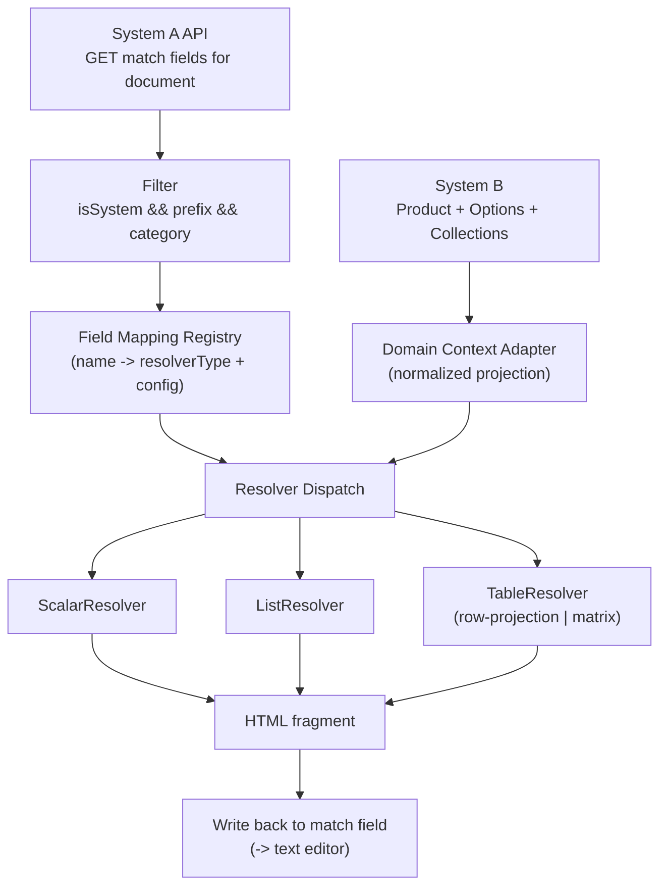

# Automated Document Data Mapping — Resolver Architecture Plan

Design for automatically filling System A's document match fields with data
sourced from System B, without hand-wiring every field name to a piece of
code.

## The two systems

- **System A** — where users configure *document match fields*. Exposes an
  API: given a document, return its match fields. Each one looks like:

  ```
  MatchField {
    isSystem: boolean   // true = a system-resolvable field, not free text
    name: string        // admin-chosen, prefixed, e.g. "PRD_product_option_benefits"
    category: string    // e.g. "product"
  }
  ```

  Only fields where `isSystem == true`, `name` starts with a configured
  prefix (e.g. `PRD_`), and `category` is one this pipeline owns are in
  scope. Everything else belongs to some other domain's resolution
  pipeline.

- **System B** — the "product system," which owns the actual data. A
  `Product` has a list of `ProductOption`s; each option has scalar fields
  (name, code) and collections (benefits, eligibility rules, benefit
  limits, ...). The document itself belongs to the `Product`, not to any
  one option — so a single match field on the document often needs to
  render data spanning *all* of a product's options at once (e.g. a
  benefits table with one column per option).

## Why "smart naming conventions" don't work

Match field names are typed by administrators based on how *they* read the
document, not by any contract with System B's schema. `PRD_benefits`,
`PRD_product_option_benefits`, and `PRD_option_benefits_table` could all
mean the same thing depending on who set up the template. Trying to infer
the mapping from the string is fragile and fails silently the moment
someone names a field slightly differently. The mapping needs to be
**explicit, versioned data**, not a naming convention.

## Architecture

Three layers, kept separate on purpose:



### 1. Field Mapping Registry (the bridge)

A lookup, keyed by the **exact** match field name (these come from a known,
finite set per document/category, not arbitrary strings at runtime):

```
FieldMapping {
  matchFieldName: "PRD_product_option_benefits"
  category: "product"
  resolverType: "scalar" | "list" | "table"
  resolverConfig: { ... }   // shape depends on resolverType, see below
}
```

This should be data (DB-backed config, editable without a deploy), not
code. **Adding a new match field of an existing shape is a config row.
Only a genuinely new shape requires new code.**

A match field with no mapping entry must be surfaced (logged/flagged as
"unmapped"), never silently dropped — since names are free text, new ones
will keep appearing as documents and templates evolve, and this is the
queue that tells a maintainer a mapping (or occasionally a new resolver)
is needed.

### 2. Domain Context Adapter

Resolvers never touch System B's raw domain/ORM objects. They read a
normalized projection instead:

```
ProductContext {
  product: { name, code, ... }        // scalars
  options: [
    { name, code, ...,
      benefits: [ { code, name, value }, ... ],
      eligibilityRules: [ { code, text }, ... ],
      benefitLimits: [ { code, label, amount }, ... ],
    },
    ...
  ]
}
```

Collections are addressed by a registered name (`"benefits"`,
`"eligibilityRules"`), not a generic reflection path — keeps this typed
against System B's real schema and avoids inventing a fragile expression
language.

### 3. Resolvers

Common interface:

```
resolve(context: ProductContext, config: ResolverConfig) -> string  // HTML
```

**ScalarResolver** — one value, escaped into HTML.
```
{ path: "product.code" }
```

**ListResolver** — one collection, rendered `<ul><li>`.
```
{ collectionPath: "product.eligibilityRules", itemField: "text" }
```

**TableResolver** — one implementation, two axis strategies, because both
are "build an HTML table," just with different row/column logic:

- `rows-per-item` (static shape — fixed columns, e.g. "Cover Option /
  Frequency / Maximum Limit"):
  ```
  {
    axis: "rows-per-item",
    itemsPath: "options",              // or a nested collection
    columns: [
      { header: "Cover Option", field: "name" },
      { header: "Frequency", field: "frequency" },
      { header: "Maximum Limit", field: "amount" },
    ]
  }
  ```
  One row per item, cells = static field projections.

- `matrix` (dynamic shape — columns = options, rows = union of a nested
  collection across all options, e.g. the benefits table):
  ```
  {
    axis: "matrix",
    columnItemsPath: "options",
    columnLabelField: "name",
    rowCollectionPath: "benefits",     // nested inside each column item
    rowKeyField: "code",               // aligns rows across columns
    rowLabelField: "name",
    cellValueField: "value",
  }
  ```
  Rows are the **union** of `rowKeyField` values seen across all options'
  `benefits`, so an option missing a given benefit renders an empty cell
  instead of shifting every other row out of alignment. This same config
  shape covers eligibility-rules-as-matrix or benefit-limits-as-matrix —
  it's the general "N owners × their sub-collection" table, not
  benefits-specific.

### 4. End-to-end flow

1. Call System A for the document's match fields.
2. Filter to `isSystem == true`, prefix + category in scope.
3. Look up each field's name in the Field Mapping Registry. Unmapped →
   flag, don't fail the whole run.
4. Build the `ProductContext` from System B for the document's product.
5. Dispatch each mapped field to its resolver → HTML fragment.
6. Write the fragment back onto the match field for the downstream text
   editor to pick up (out of scope here).

## Onboarding a new field (the point of this design)

| Situation | Work required |
|---|---|
| New scalar on an already-modeled object | Add a mapping row, no code |
| New list off an existing collection | Add a mapping row, no code |
| New table matching `rows-per-item` or `matrix` | Add a mapping row + config, no code |
| Genuinely new shape (e.g. nested/multi-level table, conditional styling) | Write one new resolver, register it, then it's config-only from then on |

## Open questions to confirm before building

1. **Where does the Field Mapping Registry live?** DB table editable via an
   admin screen (recommended, since new match fields shouldn't need a
   deploy) vs. checked-in config.
2. **Row-alignment key for matrix tables** — does System B guarantee a
   stable key (e.g. a benefit `code`) shared across options' sub-collections?
   Without one, rows can't be reliably unioned/aligned.
3. **Unmapped-field handling** — who gets notified, and does document
   generation proceed with a gap or hard-fail?
4. **HTML escaping/sanitization** — all resolver output must escape scalar
   values before insertion, since it flows into a downstream text editor.
