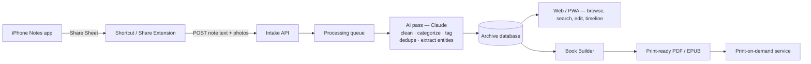

# Commonplace — Project Plan

Turning hundreds of scattered iPhone Notes into one organized archive — captured with a share, sorted automatically, and eventually printed as a book.

- **Input** — the iOS Notes app, shared note by note
- **Output** — a browsable digital archive, then a print-ready book
- **Owner** — her notes, her account, her call

## The idea

She writes constantly, but it all lives as one long, unsorted list in Notes. The fix isn't a new place to write — it's a companion that receives what she already writes, via the Share Sheet she already uses, and gives it a shape: cleaned up, categorized, searchable, and eventually typeset into something she can hold. You curate and gift the final book; she keeps full ownership and access to the living archive underneath it.

## Working name

A *commonplace book* is the historical term for exactly this — a personal book where someone collects thoughts, quotes, and fragments over years. It's a real word for a real, old practice, which is why it's the recommendation below over the more generic alternatives.

| Name | Why |
|---|---|
| **Commonplace** (recommended) | Names the actual centuries-old practice this app digitizes. Doubles as the book's title on the cover. |
| Marginalia | Evokes notes-in-the-margins; reads a touch more academic than warm. |
| Keepsake | Sells the gift-book ending well, undersells the everyday archive it is first. |

## How capture works

Native Share Sheet entries only come from an installed app with a Share Extension — a real but slow build (Xcode, an extension target, App Store or TestFlight distribution). There's a faster path to the same one-tap feeling.

**MVP shortcut, literally:** an Apple Shortcut can sit in the Share Sheet today with zero app to install. She opens a note, taps Share → Shortcuts → "Add to Commonplace," and the Shortcut posts the note's text straight to the intake API. Same one-tap motion she'd get from a custom app, shippable in the first week instead of after an App Store review. The native Share Extension becomes a Phase 5 upgrade once the archive itself has proven useful.

## Architecture

## Data model

| Entity | Key fields | Notes |
|---|---|---|
| `note` | raw_text, cleaned_text, title, ingested_at, original_date, favorite, book_included | Raw text is kept forever, untouched — cleanup only ever produces a second, editable copy. |
| `category` | name, icon, auto_or_manual, sort_order | AI-suggested on ingest (Recipes, Travel, Love notes, Lists, Random thoughts…); she can rename, merge, or override any of it. |
| `tag` | name | Free-form, many-to-many with notes; powers cross-category search. |
| `attachment` | type, url, note_id | Photos, sketches, voice memos, links carried over from the original note. |
| `book_project` | title, selected_notes[], theme, cover, status, exported_pdf_url | One row per physical book she's given — the archive can spawn more than one over time. |

## Features

**Capture**
- One-tap share-in — from the Shortcut, later a native extension
- Bulk import — paste in an export of everything at once to seed the archive on day one
- Photos & sketches carried over with the note, not dropped
- Voice memo notes transcribed on the way in

**Understand & organize**
- Auto-categorization into editable categories
- Cleanup pass — fixes fragments and typos in a separate copy, original untouched
- Duplicate detection for the three versions of the same grocery list
- Entity tagging — dates, places, names pulled out for search and the timeline

**Browse & rediscover**
- Full-text and semantic search — find the note, not just the words in it
- Timeline view across the whole span of writing
- "On this day" resurfacing of old notes
- Favorites flagged for the eventual book

**Privacy & trust**
- Her account, her data — full export of raw notes any time, no lock-in
- Passcode / Face ID lock on the archive itself
- Encrypted at rest — these are personal notes, treated like it
- She sets categories too — auto-sort is a first draft, not a verdict

**Book & gift**
- Chapter builder — arrange by category or chronology
- Themes & cover design for the printed edition
- Retrospective opening page — notes written, years spanned, most-used words
- Export to print-ready PDF or EPUB, handed to a print-on-demand service

**Later, if it earns it**
- Native Share Extension once the Shortcut MVP proves the concept
- Annual volume — a new book automatically proposed each year
- Offline-first native app for full-time daily use

## Stack recommendation

| Layer | Pick | Why |
|---|---|---|
| Capture | Apple Shortcut → Share Extension | Ship capture in week one; upgrade to a native extension only once it's earned the App Store round-trip. |
| Backend | Supabase (Postgres + Auth + Storage) | Auth, database, and file storage in one hosted piece — no server to run for an MVP this size. |
| AI processing | Claude API | Cleanup, categorization, tagging, and dedupe are all one well-scoped prompt each. |
| Front end | Next.js web app / PWA | Works from her phone's browser immediately; installable to the home screen; no App Store dependency for the reading experience. |
| Book export | Headless Chromium → print-styled PDF | HTML/CSS is the fastest path to a properly typeset, print-ready PDF; swap in a print API later. |

## Roadmap

0. **Discovery** — Pull a real export of her Notes (Notes → Export, or an iCloud backup) before writing categorization rules against imagined data. A hundred real notes will change the category list more than any amount of guessing.
1. **MVP** — Shortcut-based capture, an intake API, and a plain list-and-search web view. No AI yet — just get a note from her phone into one organized place.
2. **Intelligence** — Turn on the Claude pass: cleanup, auto-categorization, tagging, dedupe. Add the timeline view and favorites.
3. **Book builder** — Chapter arrangement, theme picker, cover upload, retrospective opening page, print-ready PDF export.
4. **The gift** — Send the finished PDF to a print-on-demand service (or a local print shop) and get an actual bound copy in hand.
5. **Stretch** — Native Share Extension, offline-first app, an annual volume proposed automatically each year.

## Worth deciding early

1. **She should know about it.** These are her personal notes — this reads best as something built with her, not a surprise system quietly reading her private writing. The book at the end can still be a surprise; the archive underneath shouldn't be.
2. **Original dates don't survive a share.** The Share Sheet hands over text, not the note's creation date — Phase 0's real export matters here, since it's the one path that preserves true dates for the timeline and the book.
3. **Shortcut first, extension later.** It's tempting to build the "real" app immediately; the Shortcut gets the exact same share-button feeling in front of her in days, not weeks.
4. **Print-on-demand vs. hand-delivered PDF.** A print API (e.g. Lulu, Blurb) automates ordering but adds integration work; a polished PDF handed to any local print shop gets a physical book sooner with a fraction of the engineering.

## Next step

Confirm she's in on building this together, then pull a real Notes export for Phase 0 — everything from category names to the Shortcut's exact fields should be shaped by what her actual notes look like, not a guess.
